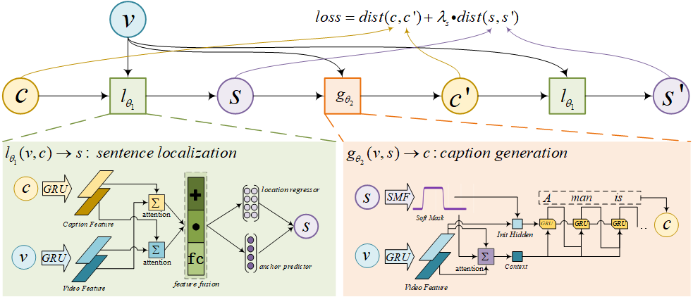
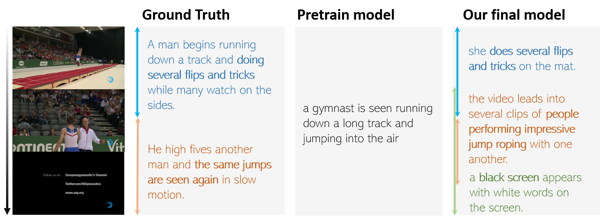

# WSDEC
This is the official repo for our NIPS paper [Weakly Supervised Dense Evente Captioning in Videos](https://nips.cc/Conferences/2018/Schedule?showEvent=113110000000).

# Description

## Repo directories
+ **./**: global config files, training, evaluating scripts;
+ **./data**: data dictionary;
+ **./model**: our final models used to reproduce the results;
+ **./runs**: the default output dictionary used to store our trained model and result files;
+ **./scripts**: helper scripts;
+ **./third_party**: third party dependency include the official evaluation scripts;
+ **./utils**: helper functions.

## Dependency
+ Python 2.7
+ **CUDA 0.9**(note: you will encounter a bug saying `segmentation fault(core dump)` if you run our code with CUDA 8.0)
+ [Pytorch 3.1](note: 3.1 is not compatible with newer version)
+ numpy, hdf5 and other necessary packages(no special requirement)

## Usage for reproduction

### Before we start
Before the training and testing, we should make sure the data, third party data are prepared, here is the one-by-one steps to make everything prepared.

**1. Clone our repo and submodules**
```
git clone --recurssive https://github.com/XgDuan/WSDEC
```

**2. Download all the data**
+ Download the official C3D features, you can either download the data from the website or from our *onedrive* cloud.
  + Download from the [official website](https://cs.stanford.edu/people/ranjaykrishna/densevid/);
    (Note, after you download the C3D features, you can either place it in the `data` folder and rename it as `anet_v1.3.c3d.hdf5`, or create a soft link in the data dictionary as `ln -s YOURC3DFeature data/anet_v1.3.c3d.hdf5`)
+ Download the dense video captioning data from the [official website](https://cs.stanford.edu/people/ranjaykrishna/densevid/);
  (Similar with the C3D feature, you are supposed to place the download data in the `data` folder and rename it as `densecap`)
+ Download the data for the official evaluation scripts `densevid_eval`;
  + run the command `sh download.sh` scripts in the folder `PREFIX/WSDEC/third_party/densevid_eval`;

+ [Good News]: we write a shell script for you to download the data, just run the following command:
    ```
    cd data
    sh download.sh
    ```

**3. Generate the dictionary for the caption model**
```
python scripts/caption_preprocess.py
```
### Training

There are two steps for model training: pretrain a not so bad caption model; and the second step, train the final/baseline model.

Our pretrained captioning model is trained.
```
python train_cg_pretrain.py
```
#### train our final model
```
python train_final.py --checkpoint_cg YOUR_PRETRAINED_CAPTION_MODEL.ckp --alias MODEL_NAME
```
#### train baselines
1. train the baseline model without classification loss.
```
python train_baseline_regressor.py --checkpoint_cg YOUR_PRETRAINED_CAPTION_MODEL.ckp --alias MODEL_NAME
```
2. train the baseline model without regression branch.
```
python train_final.py --checkpoint_cg YOUR_PRETRAINED_CAPTION_MODEL.ckp --regressor_scale 0 --alias MODEL_NAME
```


#### About the arguments
All the arguments we use can be found in the corresponding training scripts. You can also use your own argumnets if you like to do so. But please mind, some arguments are discarded(This is our own reimplementation of our paper, the first version codes are too dirty that no one would like to use it.)

### Testing
Testing is much more than training. Firstly, in the process of training, our scripts will call the `densevid_eval` in a subprocess everytime after we run the `eval` function. From these results, you can have a general grasp about the final performance by just have a look at the `eval_results.txt` scripts. Secondly, after some epoches, you can run the evaluation scripts:
1. evaluate the `full` model or `no_regression` model:
```
python evaluate.py --checkpoint YOUR_TRAINED_MODEL.ckp
```

2. evaluate the `no_classification` model:
```
python evaluate_baseline_regressor.py --checkpoint YOUR_TRAINED_MODEL.ckp
```

3. evaluate the `pretrained` model with random temporal segment:
```
python evaluate_pretrain.py --checkpoint YOUR_PRETRAIN_CAPTION_MODEL.ckp
```

## Other usage
Besides reproduce our work, there are at least two interesting thing you can do with our codes.


### Train a supervised sentence localization model
To know what is sentence localization, you can have a look at our paper `ABLR`.
Note that our work at a matter of fact provides a unsupervised solution towards sentence localization, we introduce the usage for supervised model here. We have wrote the trainer, you can just run the following command and have a cup of coffee:
```
python train_sl.py
```

### Train a supervised video event caption generation model
If you have read our paper, you would find that event captioning is the dual task of the aforementioned sentence localization task. To train such a model, just run the following command:
```
python train_cg.py
```

## BUGS
You may encounter an cuda interal bug that says `Segmentation fault(cure dumped)` during training if you are using cuda 8.0. If such things happen, try upgrading your cuda to 9.0.

# Trained model and results

## Links for our trained model
You can download our pretrained model for evaluation or further usage from [our onedrive](https://1drv.ms/u/s!AjxjQIlQsEz1owg4VxbDG9ZY4Hxt), which includes a pretrained caption generator(cg_pretrain.ckp), a baseline model without classification loss(baseline_noclass.ckp), a baseline model without regression branch(baseline_noregress.ckp), and our final model(final_model.ckp).

## demo results


# Cite the paper and give us star
